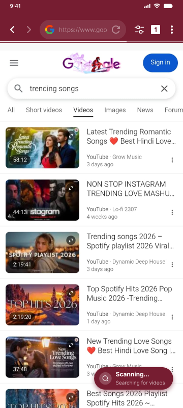
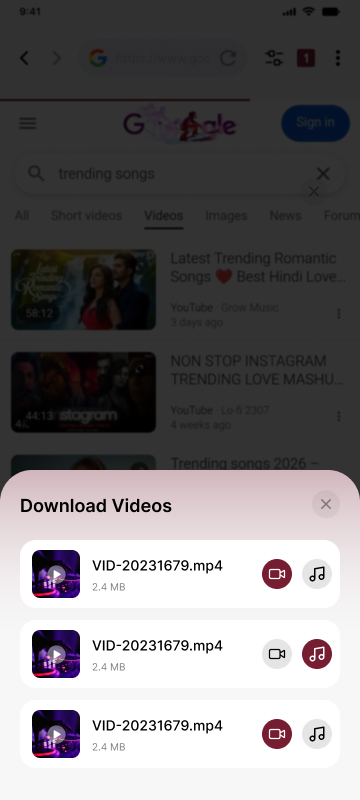
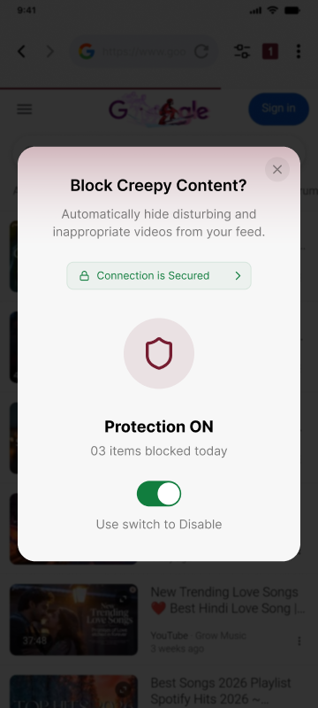
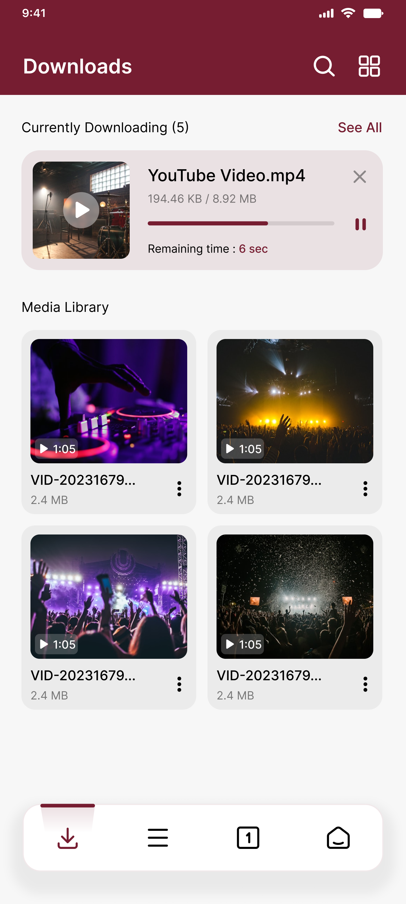

# Private Browser for Android — Zed 🔒

**The best private browser for Android with built-in ad blocker, video downloader, and incognito mode. Browse privately, block ads, download videos — all in one fast, lightweight app.**

---

---

## 🛡️ What is Zed Private Browser?

Zed is a **free private browser for Android** that puts your privacy first. Unlike ordinary browsers that save everything you do, Zed works as a **permanent incognito browser** — your browsing history, cookies, cache, and session data are **wiped automatically** every time you close the app.

No tracking. No profiling. No data collection. Ever.

Whether you need a **secure browser for Android**, a **no history browser**, or an **anonymous browsing** solution — Zed is the private browser app you've been looking for.

---

## ✨ Key Features

### 🔒 Always-On Private Browsing
Every session in Zed is **incognito by default**. No need to switch to a private tab or enable a special mode. Open the app, browse, close it — everything is erased. This is what a truly **private internet browser** should be.

### 🚫 Built-In Ad Blocker (uBlock Origin)
Zed comes with a **powerful ad blocker built in** — powered by uBlock Origin. No extensions needed. No setup required. Block pop-ups, banners, video ads, and tracking scripts automatically. Enjoy a **faster, cleaner, ad-free browsing** experience from the very first launch.

**Why this matters:** Most browsers require you to install a separate ad blocker extension. With Manifest V3 changes in 2026, many traditional ad blockers have become less effective. Zed's **native ad blocking** bypasses these limitations entirely.

### 📥 Fast Video Downloader
Download videos directly from websites with Zed's **built-in video downloader**. Save your favorite content from social media platforms, streaming sites, and video hosting services. No separate downloader app needed.

- Download videos in multiple quality options
- Save videos directly to your device
- Works on most video hosting websites
- Download and watch offline anytime

### 🕵️ Anti-Fingerprinting & Tracker Blocking
Most websites track you using cookies, browser fingerprinting, and hidden scripts. Zed **blocks trackers automatically** and uses **randomized fingerprinting** to stop websites from identifying your device.

- Block third-party cookies
- Prevent browser fingerprinting
- Block tracking scripts and pixels
- Stop cross-site tracking
- No WebRTC leak protection

### ⚡ Fast & Lightweight
Zed is designed to be **lightweight and battery-friendly**. It loads pages quickly, uses minimal memory, and delivers smooth performance even on low-end and mid-range Android devices.

### 🌙 Dark Mode
Built-in dark mode for comfortable browsing at night. Reduce eye strain and save battery on AMOLED screens.

### 🔍 Multiple Search Engines
Choose your preferred search engine — Google, DuckDuckGo, Bing, Yandex, and more. Switch anytime from settings.

---

## 📊 Zed vs Other Private Browsers for Android

Choosing the **best private browser for Android** can be confusing. Here's how Zed compares to popular alternatives:

| Feature | Zed | Brave | DuckDuckGo | Firefox Focus | Incognito Browser |
|---------|-----|-------|------------|---------------|-------------------|
| Always-on incognito mode | ✅ | ❌ | ❌ | ✅ | ✅ |
| Built-in ad blocker (uBlock) | ✅ | ✅ (custom) | ❌ | ❌ | ✅ |
| Video downloader | ✅ | ❌ | ❌ | ❌ | ✅ |
| Anti-fingerprinting | ✅ | ✅ | ✅ | ❌ | ❌ |
| Tracker blocking | ✅ | ✅ | ✅ | ✅ | ❌ |
| Auto-delete history | ✅ | ❌ | ✅ | ✅ | ✅ |
| Lightweight (low storage) | ✅ | ❌ | ✅ | ✅ | ✅ |
| Free, no premium tier | ✅ | Partial | ✅ | ✅ | ✅ |
| No data collection | ✅ | Partial | ✅ | Partial | ✅ |
| Dark mode | ✅ | ✅ | ✅ | ❌ | ✅ |

### Why Choose Zed Over Other Private Browsers?

- **Unlike Brave**, Zed doesn't bundle cryptocurrency wallets or rewards programs. It's focused purely on **private browsing and ad blocking** without bloat.
- **Unlike DuckDuckGo Browser**, Zed includes a **built-in video downloader** and a more powerful **uBlock Origin-based ad blocker**.
- **Unlike Firefox Focus**, Zed offers **tabbed browsing**, bookmarks, and a full-featured browsing experience — not just a simplified single-tab browser.
- **Unlike Chrome's incognito mode**, Zed is **always private by default** and includes ad blocking, tracker blocking, and anti-fingerprinting that Chrome doesn't offer.

---

## 🔐 Privacy & Security

Zed takes a fundamentally different approach to privacy:

**We do NOT collect:**
- ❌ Personal information
- ❌ Browsing history
- ❌ Search queries
- ❌ Location data
- ❌ Device identifiers for tracking

**We do NOT:**
- ❌ Track your browsing behavior
- ❌ Share data with third parties
- ❌ Profile you for advertising
- ❌ Sell your information

**We DO:**
- ✅ Auto-delete all browsing data on exit
- ✅ Block third-party trackers
- ✅ Randomize browser fingerprints
- ✅ Block tracking cookies
- ✅ Encrypt your connection where possible

Many browsers claim to be private but still collect your data in the background. Zed is **built for privacy from the ground up** — not privacy as an afterthought.

---

## 📱 Screenshots

  
  
  
  

---

## 🚀 Getting Started

1. **Download** Zed from the [Google Play Store](https://play.google.com/store/apps/details?id=com.browser.red)
2. **Open** the app — you're already in private browsing mode
3. **Browse** the internet without being tracked
4. **Close** the app — all data is automatically erased

No account needed. No setup required. No configuration to mess with.

---

## 💡 Use Cases

Zed is the **best private browser** for:

- 🔒 **Browsing on shared devices** — no one can see what you searched or visited
- 🏥 **Researching sensitive topics** — medical, legal, financial searches stay private
- 📱 **Using social media anonymously** — log in without leaving traces on the device
- 🎓 **Students** — browse privately on school or library devices
- 💼 **Professionals** — keep work browsing separate and private
- 🌐 **Public Wi-Fi** — browse securely on coffee shop, airport, or hotel networks
- 📥 **Downloading videos** — save content from websites for offline viewing
- 🚫 **Ad-free browsing** — enjoy the web without pop-ups, banners, or video ads

---

## 🆚 Frequently Asked Questions

### Is Zed really a private browser?
Yes. Zed is a **genuinely private browser** that doesn't collect any personal data. All browsing history, cookies, cache, and session data are automatically deleted when you close the app. We do not track users or share data with third parties.

### Is Zed better than Chrome incognito mode?
Yes. Chrome's incognito mode only prevents local history saving — Google can still track you. Zed goes further with **built-in ad blocking, tracker blocking, anti-fingerprinting, and zero data collection**. It's a complete **private browsing solution**, not just a mode.

### Is Zed better than Brave browser?
For users who want a **focused, lightweight private browser** without cryptocurrency features, Zed is a better choice. Brave is an excellent browser but comes with crypto wallets, rewards programs, and a larger app size. Zed is **purely focused on privacy, ad blocking, and simplicity**.

### Does Zed have a video downloader?
Yes. Zed includes a **built-in video downloader** that works on most websites. You can save videos in multiple quality options directly to your device — no separate app needed.

### Is the ad blocker in Zed effective?
Zed uses **uBlock Origin** — widely considered the most powerful ad blocker available. It blocks pop-ups, banners, video ads, and tracking scripts. With Manifest V3 limiting traditional browser extensions in 2026, Zed's **native integration** gives it an advantage over extension-based ad blockers.

### Does Zed work on low-end Android phones?
Yes. Zed is designed to be **lightweight and battery-friendly**. It works well on low-end and mid-range Android devices, with fast page loading and minimal memory usage.

### Is Zed free?
Yes. Zed is **100% free** to download and use. No premium tier, no subscriptions, no in-app purchases for core features.

### How is Zed different from Incognito Browser by CoinCircle?
Zed includes **uBlock Origin-based ad blocking** and **anti-fingerprinting** technology that the Incognito Browser doesn't offer. Zed also uses randomized fingerprinting to prevent websites from tracking your device — a level of protection most private browsers lack.

---

## 🛠️ Technical Details

| Detail | Info |
|--------|------|
| **Platform** | Android 7.0+ |
| **Engine** | WebView-based with custom privacy layer |
| **Ad Blocker** | uBlock Origin (native integration) |
| **Languages** | English, Urdu, Hindi, Arabic, and more |
| **Developer** | Sirius A Tech |
| **Category** | Tools / Privacy / Browser |
| **Price** | Free |
| **Play Store** | [com.browser.red](https://play.google.com/store/apps/details?id=com.browser.red) |

---

## 🌍 Available Languages

Zed supports multiple languages to serve users worldwide:

- 🇺🇸 English
- 🇵🇰 Urdu (اردو)
- 🇮🇳 Hindi (हिन्दी)
- 🇸🇦 Arabic (العربية)
- 🇪🇸 Spanish (Español)
- 🇵🇹 Portuguese (Português)
- 🇹🇷 Turkish (Türkçe)
- 🇮🇩 Indonesian (Bahasa Indonesia)
- And more being added regularly

---

## 📈 Why We Built Zed

We noticed that most **private browsers for Android** fall into two categories:

1. **Big-name browsers** (Brave, Firefox, DuckDuckGo) that are privacy-focused but come with bloat, large app sizes, and features most users don't need.
2. **Small private browsers** that claim to be private but are poorly made, full of hidden trackers, or lack essential features like ad blocking.

Zed fills the gap — a **fast, lightweight, feature-rich private browser** that does what it promises: protect your privacy, block ads, download videos, and stay out of your way.

---

## 🏷️ Keywords & Tags

`private browser` · `private browser for android` · `incognito browser` · `ad blocker browser` · `no history browser` · `anonymous browser` · `secure browser android` · `private browsing app` · `video downloader browser` · `ad free browser` · `tracker blocker` · `anti fingerprint browser` · `best private browser 2026` · `privacy browser android` · `incognito mode browser` · `free private browser` · `secret browser` · `safe browser` · `private web browser` · `fast private browser` · `lightweight browser android` · `browser with built-in ad blocker` · `download videos from browser` · `block ads android browser` · `private internet browser` · `anonymous browsing app` · `no tracking browser`

---

## 📬 Contact & Support

- **Email:** [info@incognitobrowser.io](mailto:info@incognitobrowser.io)
- **Play Store:** [Download Zed](https://play.google.com/store/apps/details?id=com.browser.red)
- **Issues:** Use the [Issues tab](../../issues) on this repository to report bugs or request features

---

## ⭐ Support the Project

If you find Zed useful, please:

1. ⭐ **Star this repository** — it helps others discover Zed
2. 📲 **Rate us on Google Play** — every review helps us grow
3. 📣 **Share with friends** — word of mouth is our biggest growth channel
4. 🐛 **Report bugs** — help us make Zed better for everyone

---

## 📄 License

Zed Private Browser is proprietary software developed by Sirius A Tech. All rights reserved.

---

  <b>Stop being tracked. Stop seeing ads. Start browsing privately.</b> 
  <a href="https://play.google.com/store/apps/details?id=com.browser.red">Download Zed — Free Private Browser for Android</a>

